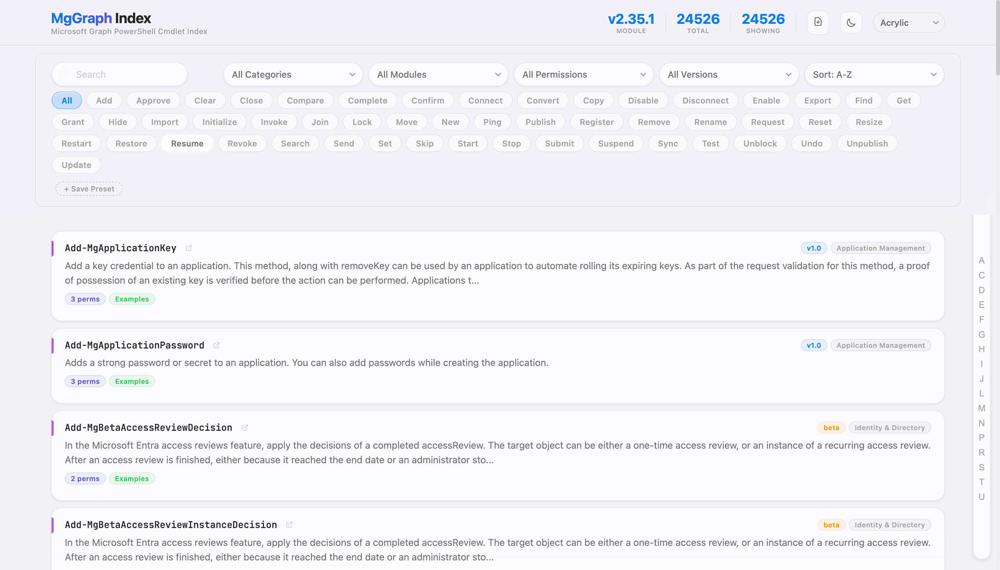
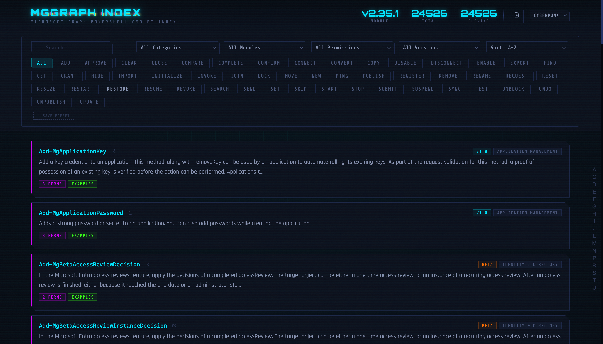
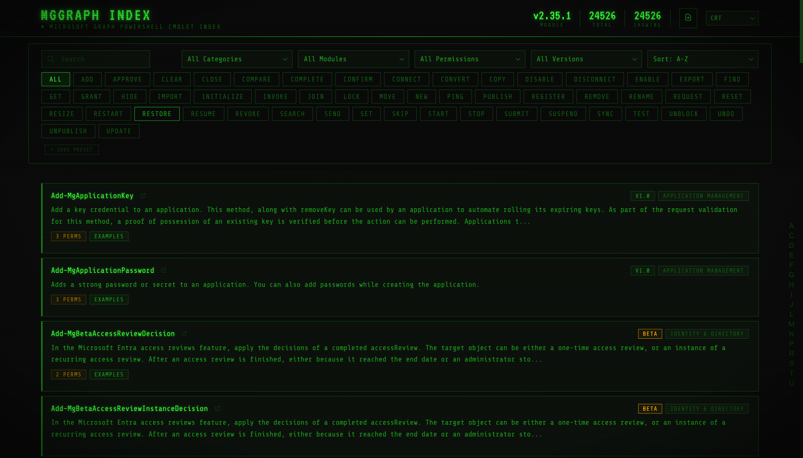
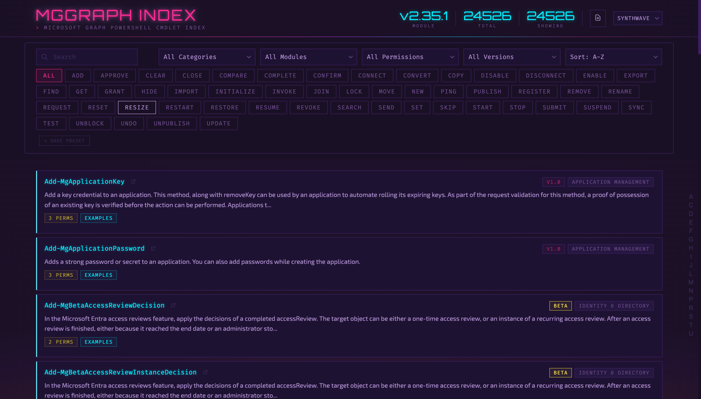
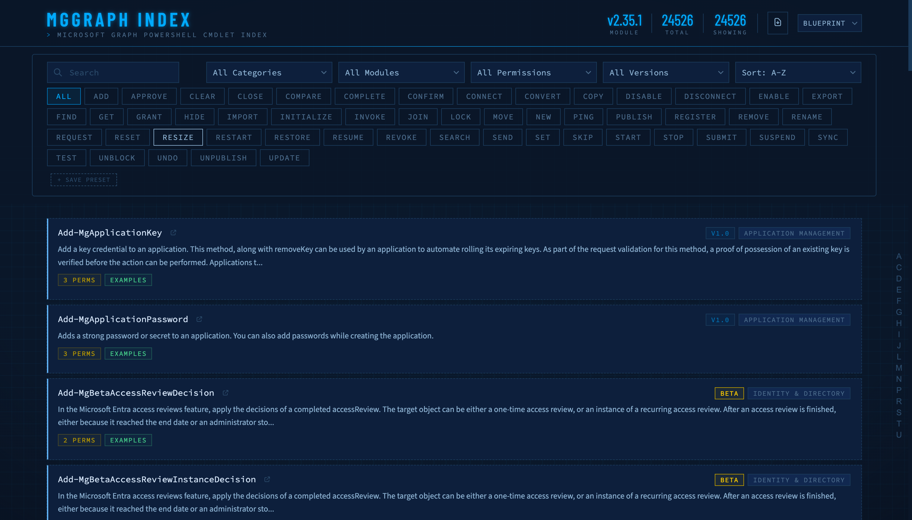
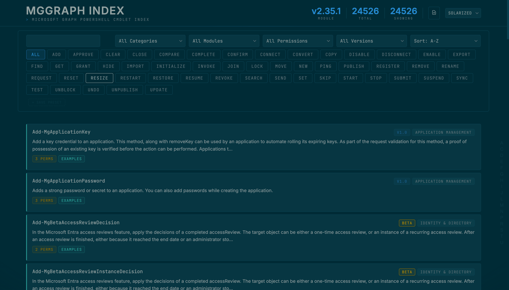
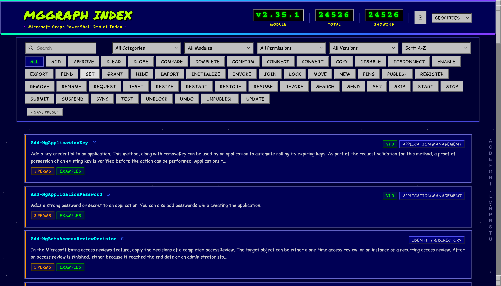

# MgGraph Index

Interactive, searchable reference for all 24,000+ Microsoft Graph PowerShell cmdlets. Static site -- no backend, no framework, no build step.

Deployed to GitHub Pages. Data updated daily via GitHub Actions.


## Quick Start

```bash
python3 -m http.server 8000 -d public
# http://localhost:8000
```

## Data Pipeline

A GitHub Actions workflow runs daily: clones the [microsoftgraph-docs-powershell](https://github.com/MicrosoftDocs/microsoftgraph-docs-powershell) repo, parses markdown into JSON, commits changes, and deploys to Pages.

To regenerate locally:

```bash
git clone --depth 1 --filter=blob:none --sparse \
  https://github.com/MicrosoftDocs/microsoftgraph-docs-powershell.git docs
cd docs && git sparse-checkout set microsoftgraph/graph-powershell-1.0 microsoftgraph/graph-powershell-beta
cd ..
python3 scripts/parse_docs.py docs/microsoftgraph
```

Alternative: extract live data from installed modules with `.\scripts\get-graphcmdlets.ps1 -IncludeBeta`.

### Data Files

| File | Purpose |
|------|---------|
| `public/data/manifest.json` | Compact cmdlet index (short keys). Loaded on init for search/filter |
| `public/data/modules/*.json` | Per-module detail (syntax, examples, permissions). Lazy-loaded on card expand |
| `public/data/descriptions.json` | Deferred descriptions |

The parser uses Python stdlib only -- no pip dependencies.

## Themes

Seven visual themes, each a standalone HTML file with identical JS logic. All support light/dark mode toggle and `prefers-color-scheme`.

### Acrylic (default)


### Cyberpunk


### CRT


### Synthwave


### Blueprint


### Solarized


### Geocities


## Key Features

- **Fuzzy search** with weighted scoring across name, description, category
- **Filters** -- verb, category, module, API version, permissions
- **Two-tier loading** -- manifest on init, module detail on demand
- **Keyboard navigation** -- `/` search, `j`/`k` navigate, `Enter` expand
- **URL hash state** -- shareable filtered views
- **Export** -- JSON or CSV of filtered results
- **Filter presets** -- save/restore to localStorage

## Project Structure

```
public/
  *.html                    Theme variants (7 files)
  data/
    manifest.json           Cmdlet index (~3.5 MB)
    descriptions.json       Deferred descriptions (~3 MB)
    modules/                Per-module detail (79 files)
screenshots/                Theme preview images
scripts/
  parse_docs.py             Python parser (primary)
  get-graphcmdlets.ps1      PowerShell extractor (alternative)
.github/workflows/
  update-cmdlet-data.yml    Daily automation + GitHub Pages deploy
```
